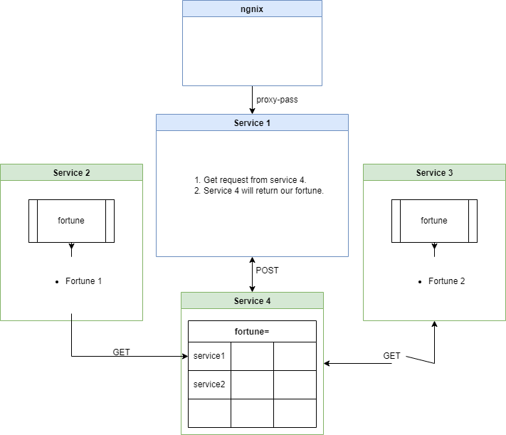
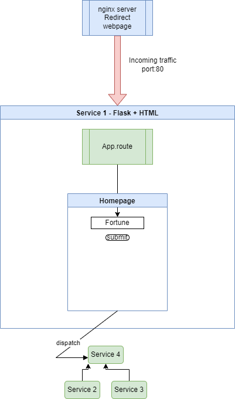
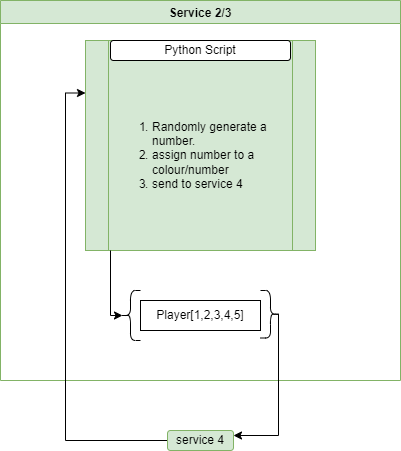
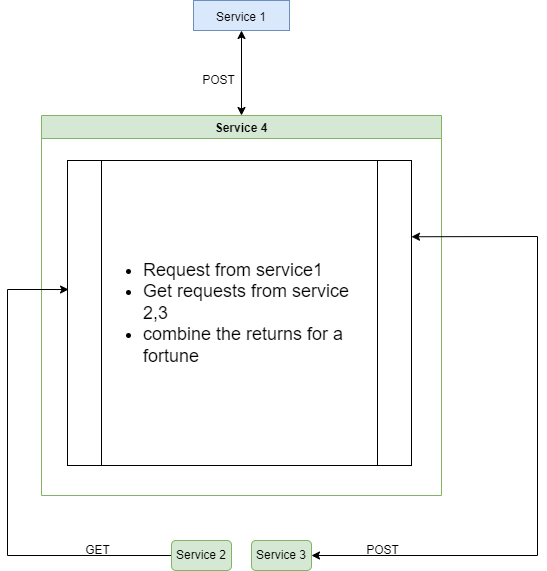
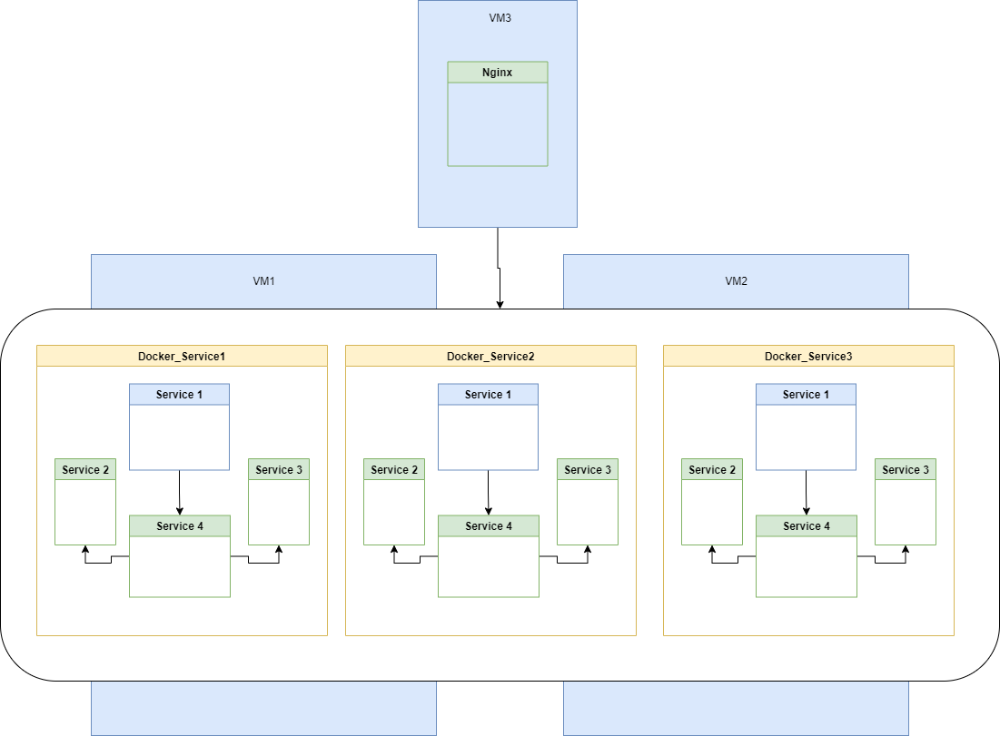
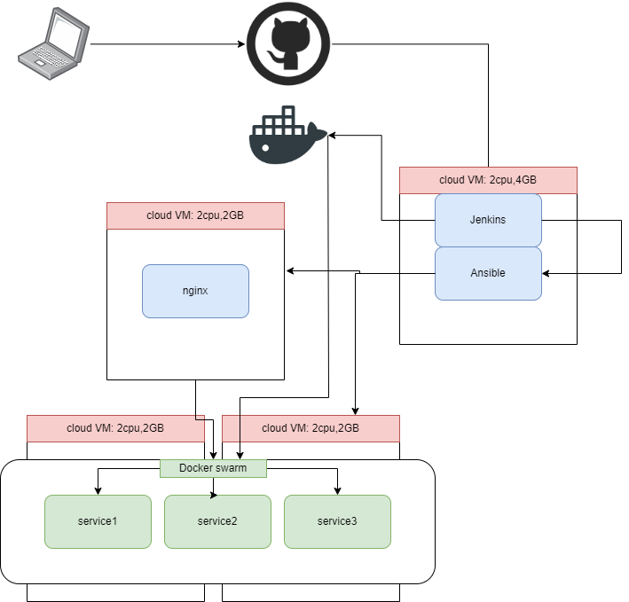
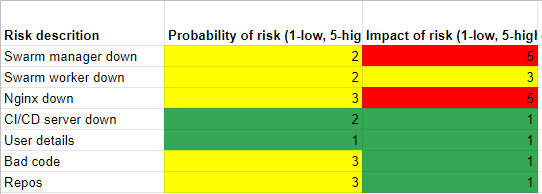

# QA--Project2-- Madam Jira

## Index
1. 1-Intro
2. 2-Overview
3. 3-Objectives
4. 4-Design notes
5. 5-Pipeline
6. 6-Security and safety
7. 7-Potential extras.

## 1-Intro
This project is designed to demonstrate my ability to creaate and manage a CI/CD pipeline by creating a web app that uses multiple apps, running on multiple containers.

## 2-Overview
The final product will be a simple web based fortune teller app. It is built using 3 Flask Api's and 1 Flask app as a disply. 
1. The App
the applications are build using Python3 and Flask. The first App acts as a disply for the information generated by App 2-4. These applications were designed to be containerised.
2. CI/CD Server
Jenkins was used as the CI server to better manage the pipeline of our product. Jenkins was able to automate the entire CI/CD pipleine. In addition to Jenkins Ansible was used to ensure the machine states of our services was correct. 
3. Version Control
Both Github and Docker hub were used as version control platforms. Github was used to house the RAW code for the project while Docker Hub is used to house our working images of the apps.
4. Project managment
In order to manage the various tasks for this project, a Jira project was created called Madam Jira. All tasks were added to this board in order to record the progress of the project.

## 3-Objectives
1. have a simple web based fortune teller
2. Link 4 services to each other in containers
3. Create a fully automated jenkins pipeline.
4. Create an enviroment capable of live updates

## 4-Design notes
1. The final product will be a web based flask app. The app will be built up with 4 flask services. The entire pipeline must be automated for full CI/CD flow.

2. Services 
1. The outline of all 4 services:
    The 4 flask services will work togther. Service 1 will act as the display service while service 2 and 3 are simple GET Api's. Service 4 will GET from service 2 and 3 and coimbine the results before sending the results to service1 for display.

2. Service 1: 
    Service 1 will function as a simple Flask app, rendering the information from service 4 into sopmething a user can interact with.

3. Service 2 and 3:
    Services 2 and 3 each randomly determine a number and assign a colour or number to the service based upon the random result. This new value (colour/number) are then sent to service 4 for processing. 

4. Service 4:
    Service 4 taken the results from service 2 and 3 and combines them into a new fortune. This fortune is then sent to service 1 for display.

5. pytest-cov
    Each service had basic tests built for it to ensure a functional app when deployment came.

3. Containerisation
The purpose of buildiung each app as a seperate image is to allow us to use docker swarm to deploy multiple copies of the app for load balancing and redundency. Below is an outline of how the final service should function when deployed.

4. Jenkins and Ansible

    1. Jenkins
    Jenkins would serve as our CI server, taking new code and testing it before passing the job to ansible for deployment.

    2. Ansible
    Ansible serves as our CD server, taking the project details from Jenkins and deploying it to our various servers.

5. tools used
IDE= Visual studio code
cloudhost= Google cloud
version control= Github/docker hub
CI server= Jenkins
CD server= Ansible
Code= Python + html + docker + yaml
Modules = Flask, Mysql.connector, pytest, pytest-cov, mock-testing, requests

## 5-Pipeline
The pipeline for this project follows a specific path which is outlined below:

1. As new code is created from a user IDE it is uploaded to Github. This triggers the second step. 
2. Once Github detects a new commit it will send a webhook to the Jenkins server and initiate a new build job.
3. Jenkins will run through the deployment script, starting with testing, then building the containers and checking that they run without issue.
4. Jenkins will then push the newly created images to docker hub and trigger ansible to deploy.
5. Ansible recieves the build playbook and will start by first ensuring the machines are live, then that the states are correctr, configure any changes and restart the needed services.
6. Nginx and the docker swarm will update with any new configurations and end the pipeline.

## 6-Security and safety

Below are a number of risks and their potential impact on the product. risks are valued between 1 and 5 with 1 being low risk and 5 being high risk. Impact of risk is also rated in 1-5, being low impact to high impact.

1. Swarm manager goes down Risk 2/ Impact 5
In the event that the VM hostiung the swarm manager goes down we will have no service running. This is a medium risk with very high impact. We can mitigate this by adding another swarm manager vm.

2. Swarm Worker goes down Risk 2/ Impact 3
In the event that the swarm worker goes down we will still have a service running however only on the manager. This is a medium risk with medium impact. We can add more swarm workers to lower the impact further.

3. Nginx goes down Risk 3/ Impact 5
In the event that the Nginx server goes down our entire app will be unreachable. There is a low-medium risk of this happening but a very high impact if it does. we can mitigate the impact by adding a redundent Nginx server.

4. CI/CD server down Risk 2/ Impact 1
In the event that the CI/CD server goes down we will be unable to push new code and images. Although the risk is low-medium the impact is low as this will not effect our product.

5. User details Risk 1/ Impact 1
As we do not collect user details we have a low risk and low impact for leakijng user details.

6. Bad code Risk 3/ Impact 1
In the event bad code is pushed to Github and pulled into our CI/CD pipeline it could have disasterous effects, however with the testing in place to ensure code runs correctly the impact is low.

7. Repos Risk 3/ Impact 1
Using public repos like githun and docker hub are fine for a none sensative project like this however there is a medium risk that our code will be exposed to the outside world. But this has little risk to the product as it is not propriatory. 

## 7-Potential extras
In the future i would like to add some of the below features:

1. Lotto ticket number generator
2. Horoscope based upon your star sign
3. user creation function so that we can gather user info
4. database connection to store user info and past fortunes